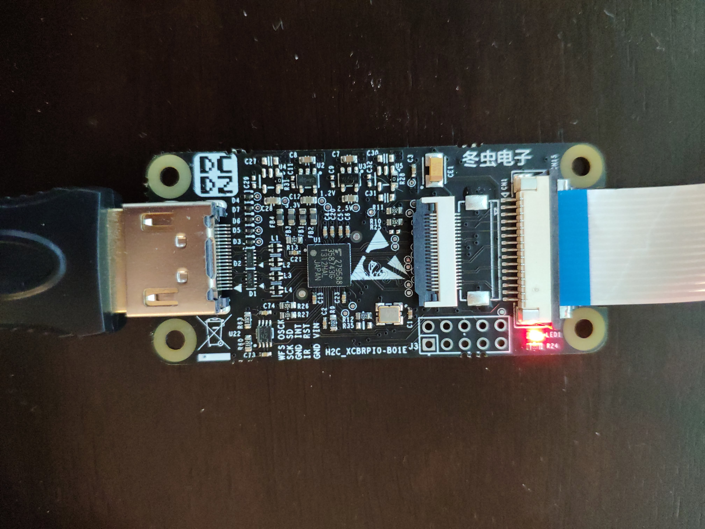
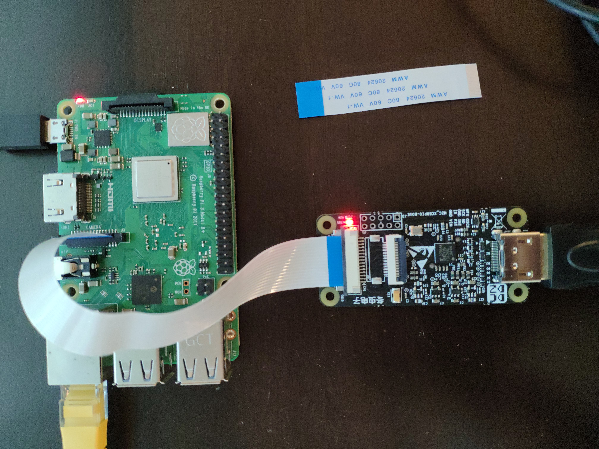

# hdmi-capture
Notes about capturing HDMI on the Raspberry Pi.

## Purpose:
The purpose of this repository is to collect information on capturing HDMI with a Raspberry Pi. Note that this is not an authoritative guide on HDMI, CSI, or any other topics. This is just a place for me to keep my notes.

## Hardware:
The hardware used for these experiments is a HDMI to MIPI CSI-2 board that was obtained from [AliExpress](https://www.aliexpress.com/item/4000152180240.html). The board contains a Toshiba TC358749XBG HDMI-RX to MIPI CSI-2-TX bridge IC ([datasheet](media/(U18)TC358749XBG_V074.pdf)). The board connects to the Raspberry Pi via the flat flex camera connector.

HDMI to CSI-2 Board |
------------ |
 |

Connection to Raspberry Pi |
------------ |
 |

**Note:** The Raspberry Pi only exposes 2 lanes of the CSI interface (except for some of the compute modules). As such, this limits the resolution and framerate of the HDMI signal that can be captured.

## Software Configuration:
To enable the capture card, a few changes have to be made to the `/boot` partition of the Raspberry Pi.

1. The amount of memory for the CMA needs to be increased. This is accomplished by adding the following to `/boot/cmdline.txt`
```
cma=128M
```
2. The TC358749XBG overlay needs to be enabled. This is accomplished by appending the following to `/boot/config.txt`
```
dtoverlay=tc358743
```
3. It probably doesn't hurt to increase the amount of memory for the VideoCore. Append the following to `/boot/config.txt`
```
gpu_mem=256
```

## Sound:
The Toshiba IC does have the ability to receive sound from the HDMI source, and the I2S pins are broken out on the board, but there is evidence to suggest that it does not work properly with the Raspberry Pi. A `tc358743-audio.dtbo` overlay does exist though.

## The EDID:
The EDID is a block of data that the HDMI sink presents to the HDMI source. It lists the formats and timings that are supported by the HDMI sink. Example EDID blocks can be found in [edid/](edid/). Because of the two lane limitation noted above, the maximum resolution and framerate that can be received is 1080P at 50FPS YCbCr 4:2:2, or 1080P at 30FPS RGB24.

The EDID can be set with the following command:
```
v4l2-ctl --set-edid=file=1080P30EDID422.txt --fix-edid-checksums
```

## Misc Commands:
The following command can be used to return status information from v4l2:
```
v4l2-ctl --log-status
```

When the HDMI link is established, timing information can be checked with:
```
v4l2-ctl --query-dv-timings
```

Timing information can then be set with:
```
v4l2-ctl --set-dv-bt-timings query
```

## ffmpeg:
`ffmpeg` can be used to receive data from the HDMI to CSI bridge.

The following command can be used to view the available formats:
```
ffmpeg -f v4l2 -list_formats all -i /dev/video0
```

The following command can be used to record raw uyvy422 frames:
```
ffmpeg -f v4l2 -input_format uyvy422 -i /dev/video0 -c:v copy test.mkv
```
**Note:** The above command requires a tremendous amount of disk bandwidth to record without dropping frames.

## µStreamer:
[µStreamer](https://github.com/pikvm/ustreamer) works really well with this setup. It's nearly plug and play. The following command will start the streaming server at port 8080:
```
./ustreamer --format=UYVY --encoder=omx --workers=3 --dv-timings --drop-same-frames=30 --host=0.0.0.0
```

## GStreamer:
GStreamer can be used to efficiently encode the output of the bridge and piped elsewhere. The following command can be used on the Raspberry Pi to setup a TCP socket that presents an encoded h264 stream:
```
gst-launch-1.0 -vvv -e v4l2src ! video/x-raw,format=UYVY,framerate=60/1 ! v4l2h264enc ! h264parse ! rtph264pay config-interval=1 pt=96 ! gdppay ! tcpserversink host=0.0.0.0 port=5000
```
**Note:** The above command requires the good and bad GStreamer plugins.

The command on the receiving end can be something like:
```
gst-launch-1.0 -v tcpclientsrc host=<IP Address> port=5000 ! gdpdepay ! rtph264depay ! decodebin ! videoconvert ! autovideosink sync=false
```

## raspivid:
`raspivid` can be used to receive video from the bridge, but the TC358749XBG is not officially supported. In order to use `raspivid`, the v4l2 driver needs to be disabled (remove `dtoverlay=tc358743` from `/boot/config.txt`). The advantage to using `raspivid` is that it makes use of the MMAL API to encode the video as a h264 stream. The downside is that it automatically sets the EDID. This is an issue when the HDMI source does not have a manual override for its output settings.
